# Host Manager（主机管理系统）

- 技术栈：Python 3.11 + Django 5.0 + Django REST Framework + MySQL 8 + Redis 7 + Celery 5

> 📸 **项目运行截图**：

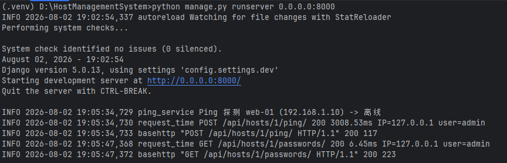

---

## 运行界面预览

### 前端测试台页面（`/test/`）

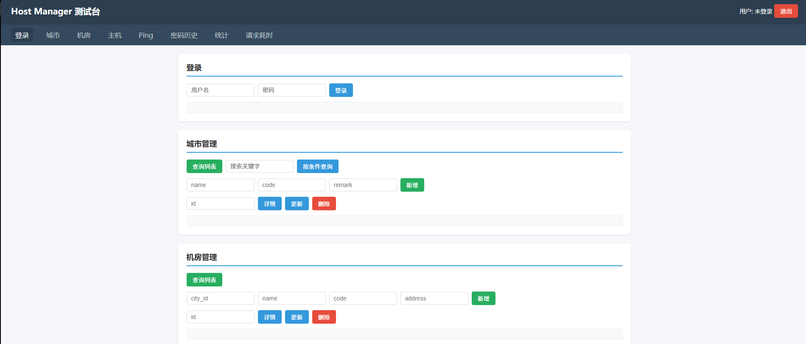


### Swagger API 文档（`/api/docs/`）

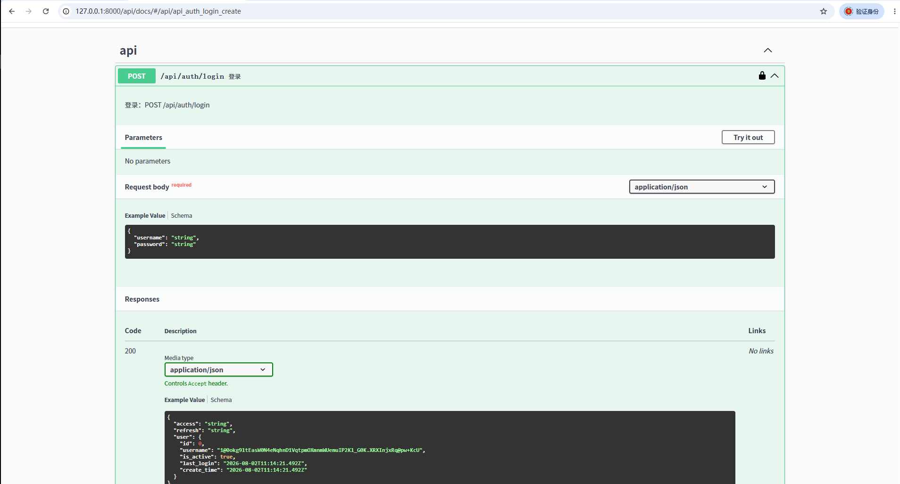

### 日志输出(主机采用尝试连接到192.168.1.10:22，触发回滚，保留旧密码)

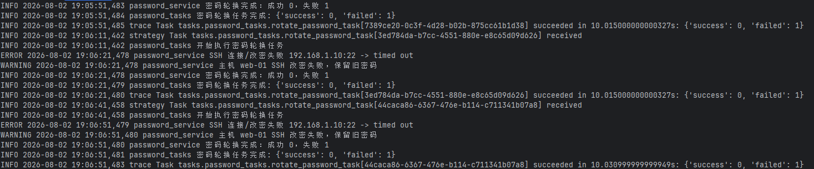
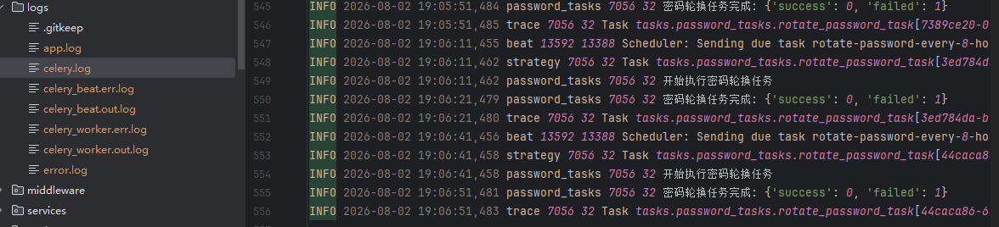

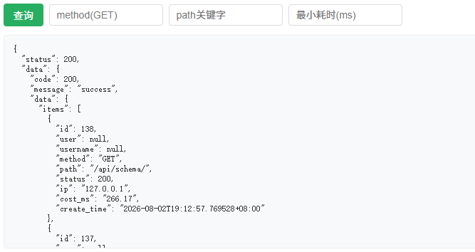

---

## 目录

- [一、功能清单](#一功能清单)
- [二、项目架构](#二项目架构)
- [三、数据模型（Models）](#三数据模型models)
- [四、数据处理与核心流程](#四数据处理与核心流程)
- [五、代码结构总览](#五代码结构总览)
- [六、核心功能实现逻辑](#六核心功能实现逻辑)
- [七、接口说明](#七接口说明)
- [八、环境要求与安装](#八环境要求与安装)
- [九、启动方式](#九启动方式)
- [十、测试与验证](#十测试与验证)
- [十一、Docker 部署](#十一docker-部署)
- [十二、常见问题](#十二常见问题)

---

## 一、功能清单

### 核心功能（F1–F7）

| 编号 | 功能 | 说明 | 实现位置 |
| --- | --- | --- | --- |
| F1 | 主机管理 | 主机 CRUD（含城市、机房关联） | `apps/host/` |
| F2 | 城市管理 | 城市 CRUD | `apps/city/` |
| F3 | 机房管理 | 机房 CRUD | `apps/idc/` |
| F4 | Ping 探测 | 探测主机是否可达，更新在线状态 | `services/ping_service.py` |
| F5 | Root 密码管理 | 密码加密存储、每 8 小时定时轮换 | `services/password_service.py` + `tasks/password_tasks.py` |
| F6 | 主机统计 | 每日 00:00 按城市/机房维度统计并落库 | `services/statistics_service.py` + `tasks/statistics_tasks.py` |
| F7 | 请求耗时统计 | 中间件统计每个请求耗时 | `middleware/request_time.py` |

### 其他功能（E1–E9）

| 编号 | 功能 | 说明 | 实现位置 |
| --- | --- | --- | --- |
| E1 | JWT 登录认证 | 基于 Token 的身份认证与权限控制 | `apps/users/` + `utils/jwt.py` |
| E2 | Swagger 文档 | 自动生成可交互 API 文档（drf-spectacular） | `config/urls.py` |
| E3 | 日志体系 | 接口日志、错误日志、Celery 日志分类 | `config/settings/base.py`（LOGGING） |
| E4 | 分页/搜索/排序 | 列表接口统一支持 | `utils/pagination.py` + DRF filters |
| E5 | 操作日志 | 记录用户关键写操作（create/update/delete） | `apps/common/models.py` + `services/operation_log_service.py` |
| E6 | 参数校验 | Serializer 层统一校验（IP、端口等） | `utils/validators.py` |
| E7 | 统一返回格式 | `{code, message, data}` 统一封装 | `utils/response.py` |
| E8 | 全局异常处理 | 统一异常，避免堆栈泄露 | `utils/exceptions.py` |
| E9 | 分环境配置 | `base / dev / prod` 配置分离 | `config/settings/` |

---

## 二、项目架构

### 2.1 分层架构

系统遵循 **`View → Service → Model`** 的三层架构，业务逻辑全部收敛到 Service 层：

```
        HTTP 请求
           │
     ┌─────▼─────┐
     │  Middleware │  RequestTimeMiddleware（请求耗时统计）
     └─────┬─────┘
           │
     ┌─────▼─────┐      ┌──────────────┐      ┌──────────────┐
     │   View    │ ───▶ │   Service    │ ───▶ │    Model     │
     │ (ViewSet) │      │ (业务逻辑层)  │      │  (ORM持久化)  │
     └─────┬─────┘      └──────────────┘      └──────────────┘
           │                  │  Host / Password / Ping / Statistics
           ▼
     ┌────────────┐      ┌────────────┐
     │  序列化器    │      │  Redis/MySQL │
     │ Serializer │      │  (Celery)  │
     └────────────┘      └────────────┘
```

- **View 层**：只负责参数接收 → 调用 Service → 封装返回；
- **Service 层**：业务规则核心（密码轮换、Ping 探测、统计、主机操作），可被 View 与 Celery Task 复用；
- **Model 层**：数据持久化与约束；
- **禁止出现 `View → Model` 的绕过写法**。

### 2.2 目录结构

```
HostManagementSystem/
├── config/                  # 项目配置（settings 分环境）
│   ├── settings/
│   │   ├── base.py          # 公共配置（应用/中间件/数据库/DRF/Celery/日志）
│   │   ├── dev.py           # 开发环境（DEBUG=True）
│   │   └── prod.py          # 生产环境（DEBUG=False，安全加固）
│   ├── urls.py              # 根路由（admin、api、Swagger、测试页）
│   ├── api_urls.py          # API 子路由汇总
│   ├── wsgi.py / asgi.py    # 部署入口
│   └── views.py             # 测试页视图
├── apps/                    # 业务应用
│   ├── users/               # 用户与 JWT 认证
│   ├── city/                # 城市管理
│   ├── idc/                 # 机房管理
│   ├── host/                # 主机管理（含密码历史、Ping、signals）
│   ├── statistics/          # 主机统计 + 请求日志
│   └── common/              # 公共组件（OperationLog、基类）
├── services/                # 业务逻辑层（核心）
│   ├── host_service.py      # 主机业务
│   ├── password_service.py  # 密码轮换/解密
│   ├── ping_service.py      # Ping 探测
│   ├── statistics_service.py# 统计业务
│   └── operation_log_service.py # 操作日志
├── tasks/                   # Celery 任务
│   ├── celery.py            # Celery 应用实例
│   ├── password_tasks.py    # 密码轮换任务
│   └── statistics_tasks.py  # 统计任务
├── utils/                   # 工具类
│   ├── encrypt.py           # 密码加解密（Fernet）
│   ├── jwt.py               # JWT 生成/校验
│   ├── response.py          # 统一返回封装（Result）
│   ├── exceptions.py        # 全局异常处理
│   ├── pagination.py        # 统一分页
│   ├── permissions.py       # 权限类
│   └── validators.py        # 自定义校验器
├── middleware/              # 自定义中间件
│   └── request_time.py      # 请求耗时统计
├── constants/               # 常量统一管理（杜绝魔法值）
│   ├── status.py            # ONLINE/OFFLINE
│   └── response_code.py     # 业务错误码
├── static/test/             # 前端测试台页面
├── docker/                  # Dockerfile + docker-compose
├── logs/                    # 日志输出目录
├── manage.py
├── requirements.txt
├── .env.example             # 环境变量示例
└── .gitignore
```

---

## 三、数据模型（Models）

共 **8 张业务表**，ER 关系：

```
City (1) ───< (N) IDC
IDC  (1) ───< (N) Host
Host (1) ───< (N) HostPasswordHistory
City (1) ───< (N) HostStatistics   # 按城市维度
IDC  (1) ───< (N) HostStatistics   # 按机房维度
User (1) ───< (N) OperationLog
User (1) ───< (N) RequestLog
```

| 表名 | Model 类 | 位置 | 关键字段/约束 |
| --- | --- | --- | --- |
| `sys_user` | `User` | `apps/users/models.py` | 继承 `AbstractUser`；`is_active`、`create_time`、`update_time` |
| `city` | `City` | `apps/city/models.py` | `name`(唯一)、`code`(唯一)、`remark` |
| `idc` | `IDC` | `apps/idc/models.py` | `city`(FK)、`name`、`code`(唯一)、`address`；`(city,name)` 联合唯一 |
| `host` | `Host` | `apps/host/models.py` | `hostname`(唯一)、`ip`(唯一)、`port`(默认22)、`idc`(FK)、`status`、`os_type`、`remark` |
| `host_password_history` | `HostPasswordHistory` | `apps/host/models.py` | `host`(FK)、`encrypted_password`(VARBINARY512)、`is_active`、`valid_from`、`expire_at`；`(host,is_active)` 索引 |
| `host_statistics` | `HostStatistics` | `apps/statistics/models.py` | `dimension`、`city`(FK)、`idc`(FK)、`total/online/offline_count`、`stat_date`；联合唯一 |
| `operation_log` | `OperationLog` | `apps/common/models.py` | `user`(FK)、`action`、`resource`、`resource_id`、`detail`(JSON)、`ip` |
| `request_log` | `RequestLog` | `apps/statistics/models.py` | `user`(FK)、`method`、`path`、`status`、`ip`、`cost_ms`(DECIMAL) |

**关键设计**：
- **密码独立历史表**：主机 root 密码单独存放于 `host_password_history`，不与主机基本属性混存，便于权限隔离、历史追溯与轮换回滚；
- **统计幂等**：`host_statistics` 通过 `(dimension, city, idc, stat_date)` 联合唯一索引保证同一维度同一天重复执行不产生脏数据；
- **级联清理**：Host 删除时由 `apps/host/signals.py` 自动清理其密码历史记录。

---

## 四、数据处理与核心流程

### 4.1 主机创建时的密码处理

1. `POST /api/hosts/` 请求进入 → `HostViewSet.create()`
2. 调用 `HostService.create_host(validated_data)`
3. 若带 `password` 字段，调用 `PasswordService.store_password()`
4. `store_password()` 内：将旧密码 `is_active` 置 0 → Fernet 加密新密码 → 写入 `host_password_history`（`is_active=1`，并记录 `valid_from/expire_at`）
5. **密码绝不通过 Serializer 返回**，仅存密文到数据库

### 4.2 密码轮换流程（每 8 小时）

```
Celery Beat(每8小时) → Redis Broker → Celery Worker
      → PasswordService.rotate_all()
      → 逐台主机 rotate_password()
          1. 解密当前密码（decrypt_current_password）
          2. 生成强随机密码（大小写+数字+特殊字符，20位）
          3. Paramiko SSH 连接主机 → 执行 `echo 'root:新密码' | chpasswd`
          4. SSH 成功 → store_password() 加密落库（旧密码失效）
          5. SSH 失败 → 保留旧密码（回滚机制，可审计追溯）
```

### 4.3 每日统计流程（每天 00:00）

```
Celery Beat(每天00:00) → Redis Broker → Celery Worker
      → StatisticsService.generate_statistics()
      → 遍历所有城市：统计该城市下所有主机的 total/online/offline
      → 遍历所有机房：统计该机房下所有主机的 total/online/offline
      → update_or_create 写入 host_statistics（联合唯一索引保证幂等）
```

### 4.4 请求耗时落库流程

```
任意 HTTP 请求 → RequestTimeMiddleware.__call__
      1. 记录 start = time.perf_counter()
      2. 执行 get_response(request) 获得响应
      3. 计算 cost = (end - start) * 1000 (ms)
      4. 写日志（method/path/status/cost/IP/user）
      5. 落库 request_log 表（供前端/报表查询）
```

---

## 五、代码结构总览

| 目录 | 职责 | 关键文件 |
| --- | --- | --- |
| `config/` | 项目启动、路由、环境配置 | `settings/base.py`、`urls.py`、`api_urls.py` |
| `apps/users/` | 用户模型、JWT 登录 | `models.py`、`serializers.py`、`views.py` |
| `apps/city/` | 城市 CRUD | `models.py`、`views.py`、`serializers.py` |
| `apps/idc/` | 机房 CRUD | `models.py`、`views.py`、`serializers.py` |
| `apps/host/` | 主机 CRUD + Ping + 密码历史 | `models.py`、`views.py`、`serializers.py`、`signals.py` |
| `apps/statistics/` | 统计查询 + 请求日志 | `models.py`、`views.py` |
| `apps/common/` | 操作日志、公共基类 | `models.py`、`serializers.py`、`views.py` |
| `services/` | 业务逻辑核心 | `host_service.py`、`password_service.py`、`ping_service.py`、`statistics_service.py` |
| `tasks/` | Celery 定时/异步任务 | `celery.py`、`password_tasks.py`、`statistics_tasks.py` |
| `utils/` | 通用工具与封装 | `encrypt.py`、`response.py`、`exceptions.py`、`pagination.py`、`jwt.py`、`validators.py` |
| `middleware/` | 请求耗时统计 | `request_time.py` |
| `constants/` | 常量统一管理 | `status.py`、`response_code.py` |
| `static/test/` | 前端测试台 | `index.html` |

---

## 六、核心功能实现逻辑

### 6.1 请求耗时中间件（`middleware/request_time.py`）

通过 Django 中间件机制在请求生命周期两侧插入计时逻辑：

```python
class RequestTimeMiddleware:
    def __init__(self, get_response):
        self.get_response = get_response

    def __call__(self, request):
        start = time.perf_counter()                       # 1. 请求进入，记录开始时间
        response = self.get_response(request)             # 2. 执行后续处理（视图/路由）
        cost = round((time.perf_counter() - start) * 1000, 2)  # 3. 计算耗时(ms)
        user = getattr(request, "user", None)
        # 4. 写日志
        logger.info(f"{request.method} {request.path} {response.status_code} {cost}ms ...")
        # 5. 落库到 request_log
        RequestLog.objects.create(user=..., method=..., path=..., status=..., ip=..., cost_ms=cost)
        return response
```

- 使用 `time.perf_counter()` 保证高精度计时；
- `get_client_ip()` 兼容反向代理 `X-Forwarded-For` 获取真实 IP；
- 落库失败（try/except）不影响主请求流程，仅记录告警；
- 该中间件在 `config/settings/base.py` 的 `MIDDLEWARE` 中注册（`middleware.request_time.RequestTimeMiddleware`）。

### 6.2 Ping 探测接口（`services/ping_service.py` + `apps/host/views.py`）

接口 `POST /api/hosts/{id}/ping/` 通过 `HostViewSet.ping` 自定义 action 实现：

```python
# apps/host/views.py
@decorators.action(detail=True, methods=["post"])
def ping(self, request, id=None):
    host = self.get_object()
    online = PingService.ping_host(host)      # 委托 Service
    return Response(Result.success(data={"id":..., "status": host.status}))
```

Ping 探测逻辑（`PingService.ping_host`）：
1. 根据系统平台构造 ping 命令：
   - Windows：`ping -n 1 -w 3000 <ip>`
   - Linux/Mac：`ping -c 1 -W 3 <ip>`
2. `subprocess.run(..., timeout=5)` 执行，并设置 **5 秒超时**；
3. 根据 `returncode == 0` 判断在线状态；
4. 捕获 `TimeoutExpired`/`SubprocessError` 等异常，超时或失败视为离线；
5. **更新 `host.status`**（online/offline）并落库。

### 6.3 密码加密与轮换（`utils/encrypt.py` + `services/password_service.py`）

**加密**（`utils/encrypt.py`）：使用 `cryptography` 库的 **Fernet**（AES-128-CBC + HMAC）对称加密，密钥从环境变量 `ENCRYPT_KEY` 读取，绝不硬编码：

```python
def encrypt_password(plain): return Fernet(KEY).encrypt(plain.encode())   # 加密
def decrypt_password(enc):  return Fernet(KEY).decrypt(enc).decode()      # 解密
```

**轮换**（`PasswordService.rotate_password`）：
- 生成 20 位强随机密码（含大小写字母、数字、特殊字符）；
- 通过 **Paramiko SSH** 连接主机（`root` 用户、旧密码），执行 `echo 'root:新密码' | chpasswd`；
- SSH 成功 → 加密新密码落库（旧密码失效）；SSH 失败 → **保留旧密码**（回滚，保证可运维性）。

### 6.4 定时任务（`tasks/` + `config/settings/base.py`）

Celery 应用实例在 `tasks/celery.py` 创建，从 Django settings 加载配置（namespace=`CELERY`），Redis 作为 **Broker（消息队列）** 和 **Backend（结果存储）**。

`CELERY_BEAT_SCHEDULE` 定义两个定时任务：

```python
CELERY_BEAT_SCHEDULE = {
    "rotate-password-every-8-hours": {
        "task": "tasks.password_tasks.rotate_password_task",
        "schedule": crontab(hour="*/8", minute=0),   # 每 8 小时
    },
    "generate-statistics-daily": {
        "task": "tasks.statistics_tasks.generate_statistics_task",
        "schedule": crontab(hour=0, minute=0),        # 每天 00:00
    },
}
```

任务只做调度，具体逻辑委托 Service：

```python
# tasks/password_tasks.py
@shared_task
def rotate_password_task():
    return PasswordService.rotate_all()

# tasks/statistics_tasks.py
@shared_task
def generate_statistics_task():
    return StatisticsService.generate_statistics()
```

### 6.5 JWT 认证（`apps/users/` + `utils/jwt.py`）

- 登录 `POST /api/auth/login` 校验用户名/密码，签发 access + refresh token；
- 后续请求通过 `Authorization: Bearer <access_token>` 携带 token；
- DRF 配置 `DEFAULT_AUTHENTICATION_CLASSES = rest_framework_simplejwt.authentication.JWTAuthentication`；
- 所有接口（除登录/刷新）默认要求认证。

### 6.6 统一返回与全局异常

- **统一返回**（`utils/response.py`）：`Result.success/fail` 生成 `{code, message, data}`，`CustomJSONRenderer` 自动包装所有响应；
- **全局异常**（`utils/exceptions.py`）：将 `ValidationError/NotFound/PermissionDenied/AuthenticationFailed/未捕获异常` 统一转换为规范结构，避免堆栈泄露。

---

## 七、接口说明

Swagger 文档（需启动服务）：
- `http://127.0.0.1:8000/api/docs/`（Swagger UI）
- `http://127.0.0.1:8000/api/schema/`（OpenAPI JSON）

前端测试台：`http://127.0.0.1:8000/test/`

| 方法 | 路径 | 说明 |
| --- | --- | --- |
| POST | `/api/auth/login` | 登录，返回 JWT |
| POST | `/api/auth/refresh` | 刷新 Token |
| GET | `/api/auth/me` | 当前用户信息 |
| GET/POST | `/api/cities/` | 城市列表/新增 |
| GET/PUT/DELETE | `/api/cities/{id}/` | 城市详情/更新/删除 |
| GET/POST | `/api/idcs/` | 机房列表/新增 |
| GET/PUT/DELETE | `/api/idcs/{id}/` | 机房详情/更新/删除 |
| GET/POST | `/api/hosts/` | 主机列表/新增 |
| GET/PUT/DELETE | `/api/hosts/{id}/` | 主机详情/更新/删除 |
| POST | `/api/hosts/{id}/ping/` | 探测主机可达性 |
| GET | `/api/hosts/{id}/passwords/` | 密码历史（脱敏） |
| GET | `/api/statistics/` | 统计列表（维度/日期筛选） |
| POST | `/api/statistics/run/` | 手动触发一次统计 |
| GET | `/api/request-logs/` | 请求耗时记录（时间/方法/路径/耗时筛选） |

**统一返回格式**：

```json
{ "code": 200, "message": "success", "data": {} }
{ "code": 400, "message": "参数错误", "data": null }
```

**错误码**：`200`成功 / `40000`参数校验失败 / `40100`未登录 / `40101`Token过期 / `40300`无权限 / `40400`资源不存在 / `40900`唯一约束冲突 / `50000`服务器内部错误。

**各功能模块界面截图**：

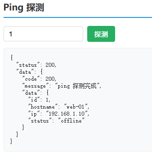

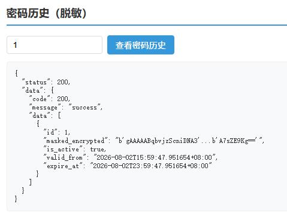

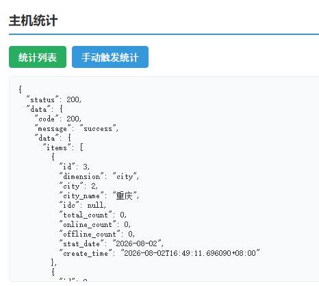

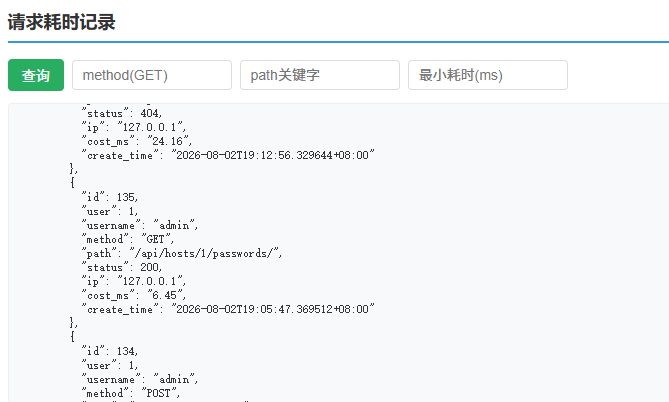

---

## 八、环境要求与安装

### 环境要求
- Python 3.11
- MySQL 8.x
- Redis 7.x（用于 Celery 定时任务）

### 安装步骤

```bash
# 1. 进入项目
cd HostManagementSystem

# 2. 创建并激活虚拟环境
python -m venv .venv
# Windows
.venv\Scripts\activate
# Linux/Mac
source .venv/bin/activate

# 3. 安装依赖
pip install -r requirements.txt

# 4. 配置环境变量
cp .env.example .env
# 编辑 .env，填写数据库账号密码、Redis、ENCRYPT_KEY、JWT 密钥

# 5. 生成加密密钥（首次部署）
python -c "from utils.encrypt import generate_key; print(generate_key())"
# 将输出填入 .env 的 ENCRYPT_KEY
```

### 数据库迁移

```bash
python manage.py makemigrations
python manage.py migrate
python manage.py createsuperuser
```

---

## 九、启动方式

```bash
# 1. Django Web 服务
python manage.py runserver 0.0.0.0:8000

# 2. Celery Worker（消费任务，Windows 下需加 --pool=solo）
celery -A tasks worker -l info --pool=solo

# 3. Celery Beat（定时任务调度）
celery -A tasks beat -l info
```

> 生产环境：`gunicorn config.wsgi:application --bind 0.0.0.0:8000`

**启动运行截图**：


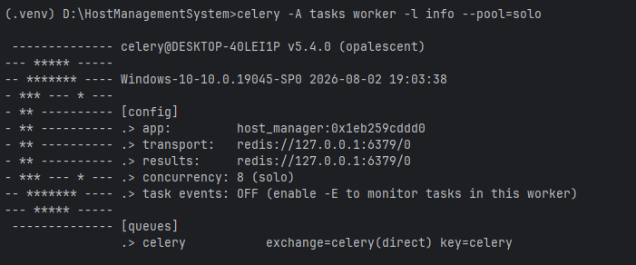

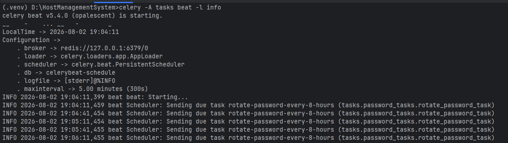

---

## 十、测试与验证

### 定时任务逻辑测试（无需 Redis）

定时任务的**核心业务逻辑**可通过 Celery 本地同步执行验证（`apply()` 不走 broker）：

```python
# 统计任务
python manage.py shell -c "from tasks.statistics_tasks import generate_statistics_task; print(generate_statistics_task.apply().get())"

# 密码轮换任务（SSH 不可达时会保留旧密码，验证回滚机制）
python manage.py shell -c "from tasks.password_tasks import rotate_password_task; print(rotate_password_task.apply().get())"
```

### 完整的定时调度测试（需 Redis）

启动 Redis 后：

```bash
celery -A tasks worker -l info --pool=solo   # 终端1（Windows 加 --pool=solo）
celery -A tasks beat -l info                 # 终端2
```

即可验证每 8 小时密码轮换、每天 00:00 统计的自动触发。

---

## 十一、Docker 部署

`docker/` 目录提供 Dockerfile 与 docker-compose.yml，一键启动 **Django + MySQL + Redis + Celery Worker + Celery Beat**：

```bash
cp .env.example .env    # 配置环境变量
docker compose -f docker/docker-compose.yml up -d
```

---

## 十二、常见问题

1. **登录提示"用户名或密码错误"**：确认密码正确，可 `python manage.py changepassword admin` 重置。
2. **新增主机前**：需先创建城市与机房，并记录其 id 填入主机。
3. **密码不展示**：主机查询/密码历史接口不会返回明文密码，仅返回脱敏加密摘要。
4. **请求耗时记录为空**：`request_log` 由中间件在每次请求时写入，调用若干接口后查询即可看到数据。
5. **定时任务不执行**：需同时启动 Celery Worker 与 Beat，且 Redis 正常连接。
6. **Ping 接口 404**：正确 URL 是 `POST /api/hosts/{id}/ping/`，中间必须有主机 id，且方法为 POST。

---
